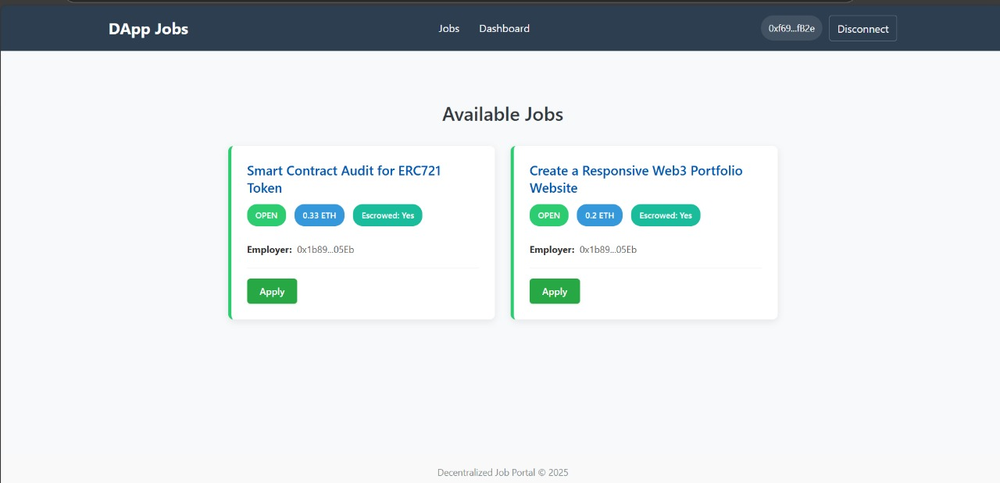
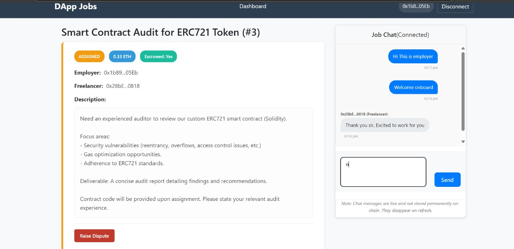
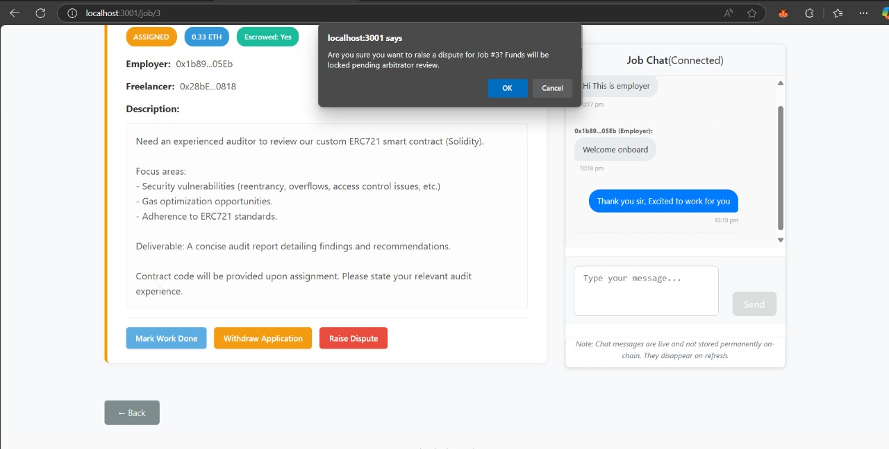
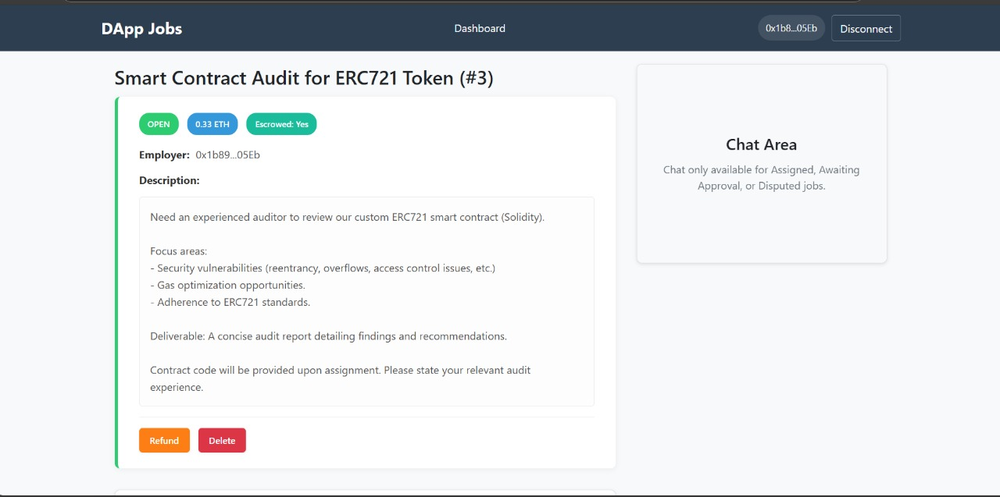
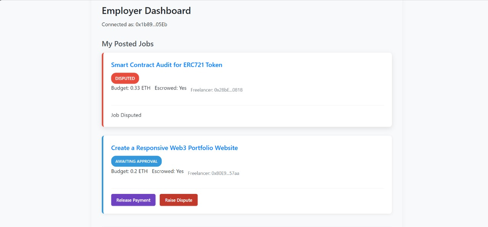

# Decentralized Job Board


A trustless job marketplace built on blockchain technology where employers can post jobs with escrowed payments, and freelancers can apply for jobs. Smart contracts automatically handle fund management and job completion processes, release payment upon approval, and handle disputes.

## Team Name - CryptoSmiths

## Team Members

- Kadirappagari Brahmisree - 230001035
- Katepalli Gayathri - 230001038
- Raunak Anand - 230001067
- Janapareddy Vidya Varshini - 230041013
- Korubilli Vaishnavi - 230041016
- Mullapudi Namaswi - 230041023

## Project Overview

The Decentralized Job Board is a blockchain-based platform that creates a trustless environment for employers and freelancers to connect, collaborate, and transact. The platform eliminates the need for intermediaries by leveraging smart contracts to manage job postings, applications, and payments. This ensures that:

1. Employers have confidence their funds are secure and will only be released upon job completion
2. Freelancers have confidence they will be paid for completed work
3. Both parties benefit from reduced fees typically charged by centralized platforms


## Key Features

- *Secure Job Posting*: Employers can create detailed job listings with titles, descriptions, requirements, and budgets
- *Escrow System*: Funds are securely locked in smart contracts until job completion, protecting both parties
- *Transparent Job Marketplace*: Freelancers can browse available jobs and view detailed information
- *Simple Application Process*: Freelancers can apply directly to jobs through blockchain transactions
- *Automated Payments*: Payment is automatically released to freelancers upon employer approval
- *Dispute Resolution*: Optional mechanisms to resolve disagreements between parties
- *MetaMask Integration*: Seamless wallet connection for Ethereum transactions
- *Role-Based Access Control*: Functions restricted to appropriate users (employers/freelancers)
- *Event Tracking*: All important actions emit blockchain events for easy tracking and frontend updates

## Architecture

The Decentralized Job Board follows a classic decentralized application (DApp) architecture:


1. *Frontend Layer*: React-based user interface that interacts with the blockchain through web3.js
2. *Blockchain Layer*: Ethereum smart contracts that handle the business logic and enforce rules
3. *Off-Chain Storage*: Pinata IPFS service for storing detailed job descriptions to reduce on-chain costs

Data flow:
- Job basic information (title, budget, status) → Stored on blockchain
- Detailed job descriptions → Stored off-chain on IPFS via Pinata with content hashes stored on-chain
- Transaction data (applications, payments) → Processed through smart contracts

## Tech Stack

### Blockchain Layer
- *Smart Contract Language*: Solidity
- *Development Framework*: Truffle Suite
- *Local Blockchain*: Ganache
- *Testing Framework*: Truffle Tests with Mocha and Chai

### Frontend Layer
- *Framework*: React.js
- *Blockchain Connection*: web3.js
- *Wallet Integration*: MetaMask

### Off-Chain Storage
- *Job Description Storage*: Pinata IPFS Service


## Prerequisites

Before you begin, ensure you have the following installed:

- [Node.js](https://nodejs.org/) (v14.0.0 or later)
- [npm](https://www.npmjs.com/) (v6.0.0 or later)
- [Truffle](https://www.trufflesuite.com/truffle) (npm install -g truffle)
- [Ganache](https://www.trufflesuite.com/ganache) - GUI or CLI version
- [MetaMask](https://metamask.io/) browser extension
### Project Structure

```
decentralized-job-board/
├── backend/                # Backend code
│   ├── build/              # Compiled contract artifacts
│   │   └── contracts/      
│   │       ├── Context.json
│   │       ├── JobBoard.json
│   │       ├── Ownable.json
│   │       └── ReentrancyGuard.json
│   ├── contracts/          # Smart contracts
│   │   └── JobBoard.sol    # Main contract
│   ├── migrations/         # Deployment scripts
│   │   └── 2_deploy_contracts.js
│   ├── test/               # Contract tests
│   │   └── DecentralizedJobBoard.test.js
│   ├── package.json        # Backend dependencies
│   ├── package-lock.json   # Dependency lock file
│   └── truffle-config.js   # Truffle configuration
├── frontend/               # React frontend
│   ├── node_modules/       # Frontend dependencies
│   ├── public/             # Static files
│   │   └── index.html      # Main HTML file
│   ├── src/                # Source files
│   │   ├── artifacts/      # Contract artifacts
│   │   │   └── JobBoard.json
│   │   ├── components/     # React components
│   │   ├── contexts/       # React contexts
│   │   │   └── Web3Context.js
│   │   ├── App.jsx         # Main App component
│   │   ├── App.css         # App styles
│   │   ├── App.test.js     # App tests
│   │   ├── config.js       # Configuration
│   │   ├── index.css       # Global styles
│   │   ├── index.js        # Entry point
│   │   └── reportWebVitals.js
│   ├── .env                # Environment variables
│   ├── .gitignore          # Git ignore file
│   ├── package.json        # Frontend dependencies
│   ├── package-lock.json   # Dependency lock file
│   └── README.md           # Frontend documentation
└── job-chat-server/        # Chat server
    ├── node_modules/       # Server dependencies
    ├── package.json        # Server dependencies
    ├── package-lock.json   # Dependency lock file
    └── server.js           # Server code
```

## Setup Instructions

### 1. Clone the Repository
```
bash
git clone : https://github.com/Namaswi24/DECENTRALIZED-JOB-PORTAL
cd decentralized-job-board
```

### 2. Install Dependencies

Install the backend dependencies:
```
bash
npm install
```

Install the frontend dependencies:
```
bash
cd client
npm install
cd ..
```

### 3. Set Up Ganache

#### Option 1: Ganache GUI

1. Open Ganache and create a new workspace
2. Click "Add Project" and select the truffle-config.js file from your project
3. Save the workspace


#### Option 2: Ganache CLI
```
bash
npx ganache-cli --port 8545 --networkId 1337 --deterministic
```

### 4. Configure MetaMask

1. Install the MetaMask browser extension if you haven't already
2. Create a new wallet or import an existing one
3. Connect MetaMask to your local Ganache blockchain:
   - Click the network dropdown at the top
   - Select "Add Network"
   - Enter the following details:
     - Network Name: Ganache
     - New RPC URL: http://127.0.0.1:8545
     - Chain ID: 1337
     - Currency Symbol: ETH


4. Import an account from Ganache:
   - Copy the private key of one of the accounts in Ganache
   - In MetaMask, click on the account icon > Import Account
   - Paste the private key and click "Import"


### 5. Set Up Pinata Account

1. Sign up for a free account at [Pinata](https://app.pinata.cloud/register)
2. Generate an API key from the Pinata dashboard
3. Add the API key and secret to your project's environment variables (create a .env file in the project root):

```
REACT_APP_PINATA_API_KEY=your_api_key
REACT_APP_PINATA_SECRET_API_KEY=your_api_secret
```

### 6. Compile and Deploy Smart Contracts
```
bash
truffle compile              # Compile the contracts
truffle migrate --reset      # Deploy to Ganache
```


### 7. Start the Frontend
```
bash
cd client
npm start
```

The application should now be running at [http://localhost:3000](http://localhost:3000).


## Using the Application

### Initial Setup

1. Open your browser and navigate to [http://localhost:3000](http://localhost:3000)
2. You'll be prompted to connect your MetaMask wallet - click "Connect"
3. Select the account you wish to use (imported from Ganache)

### User Workflows

#### As an Employer

1. *Post a New Job*
   - Navigate to the "Post Job" page from the navigation menu
   - Fill in the job details:
     - Title: A concise job title
     - Description: Detailed job requirements
     - Budget: Amount in ETH you're willing to pay
     - Click "Post Job" and confirm the transaction in MetaMask
     - Your job will now be visible on the job board
     - The detailed job description will be uploaded to IPFS via Pinata, with only the content hash stored on-chain


2. *Escrow Funds for a Job*
   - Navigate to "My Posted Jobs" page
   - Find the job you want to fund
   - Click "Escrow Funds" button
   - Confirm the transaction in MetaMask to lock the funds in the contract

3. *Review Applications and Release Payment*
   - Navigate to "My Posted Jobs" page
   - Find the job with an assigned freelancer
   - Once work is completed (agreed upon off-chain), click "Release Payment"
   - Confirm the transaction in MetaMask to transfer funds to the freelancer

#### As a Freelancer

1. *Browse Available Jobs*
   - Navigate to the "Job Board" page
   - Browse through the list of available jobs
   - Click on any job to view its details
   - Detailed job descriptions are fetched from IPFS via the stored content hash


2. *Apply for a Job*
   - On the job details page, click "Apply for Job"
   - Confirm the transaction in MetaMask
   - Wait for the employer to review and accept your application


3. *Receive Payment*
   - Complete the work as agreed upon off-chain
   - Once the employer releases payment, funds will automatically be transferred to your wallet
   - You can track payment status on the "My Jobs" page

## Frontend Screenshots


### Welcome Page


### As Employer


### Employer Dashboard


### Post Job


### Available Jobs



### Chat 



### DISPUTE



### MARK WORK DONE


### Profile/My Jobs


### Multiple applicants


### Posted Jobs


### Release Payments


### Submit Application


### Multiple applicants


### Testing 

To verify that the smart contracts are functioning correctly, run the automated tests:
```
bash
truffle test
```

This will execute all test cases in the test/ directory.


## IPFS Job Description Storage with Pinata

For more efficient storage of detailed job descriptions, we use Pinata's IPFS pinning service:

### Purpose

- Stores non-critical job data off-chain to reduce gas costs
- Maintains a link between on-chain job IDs and detailed descriptions via IPFS content hashes (CIDs)


### Integration

#### Backend Integration

1. Install the Pinata SDK in your project:
```
bash
npm install @pinata/sdk
```

2. Set up Pinata in your application:
```
javascript
const pinataSDK = require('@pinata/sdk');
const pinata = new pinataSDK({ 
    pinataApiKey: process.env.REACT_APP_PINATA_API_KEY, 
    pinataSecretApiKey: process.env.REACT_APP_PINATA_SECRET_API_KEY 
});
```

3. Upload job descriptions to IPFS:
```
javascript
const uploadToIPFS = async (jobData) => {
  try {
    const response = await pinata.pinJSONToIPFS(jobData);
    return response.IpfsHash; // This hash is stored on-chain
  } catch (error) {
    console.error('Error uploading to IPFS:', error);
    throw error;
  }
};

```
4. Fetch job descriptions from IPFS:
```
javascript
const fetchFromIPFS = async (ipfsHash) => {
  try {
    const url = `https://gateway.pinata.cloud/ipfs/${ipfsHash}`;
    const response = await fetch(url);
    return await response.json();
  } catch (error) {
    console.error('Error fetching from IPFS:', error);
    throw error;
  }
};
```

## Troubleshooting

### Contract Deployment Issues

- *Ganache Not Running*
  - Ensure Ganache is started before deploying contracts
  - Check that the network configuration in truffle-config.js matches your Ganache settings

- *Compilation Errors*
  - Run truffle compile --all to force recompilation of all contracts
  - Check Solidity version compatibility

- *Out of Gas Errors*
  - Increase the gas limit in truffle-config.js

### MetaMask Connection Issues

- *Network Mismatch*
  - Ensure MetaMask is connected to the Ganache network
  - Check that the network ID in MetaMask matches Ganache (usually 1337)

- *Transaction Stuck*
  - Reset your MetaMask account (Settings > Advanced > Reset Account) if transactions are pending indefinitely


### Frontend Issues

- *Contract Not Found*
  - Check that truffle-config.js points to the correct build directory
  - Verify that the contract address is correctly set in the frontend


### Transaction Failures

- *Insufficient Funds*
  - Ensure your MetaMask account has enough ETH for the transaction and gas fees
  - For escrow transactions, verify you're sending exactly the required amount


---
